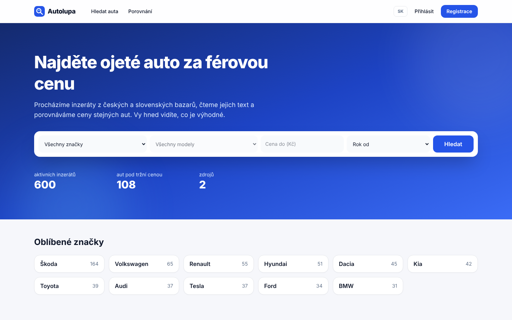
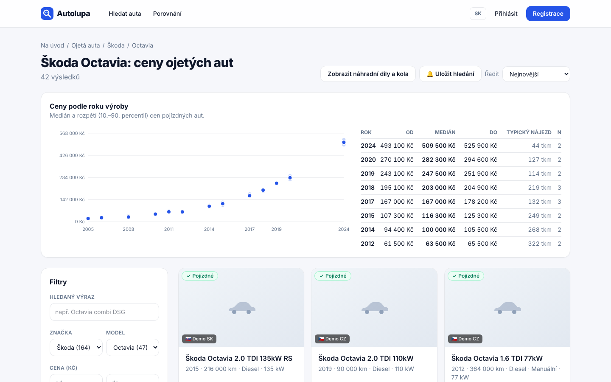
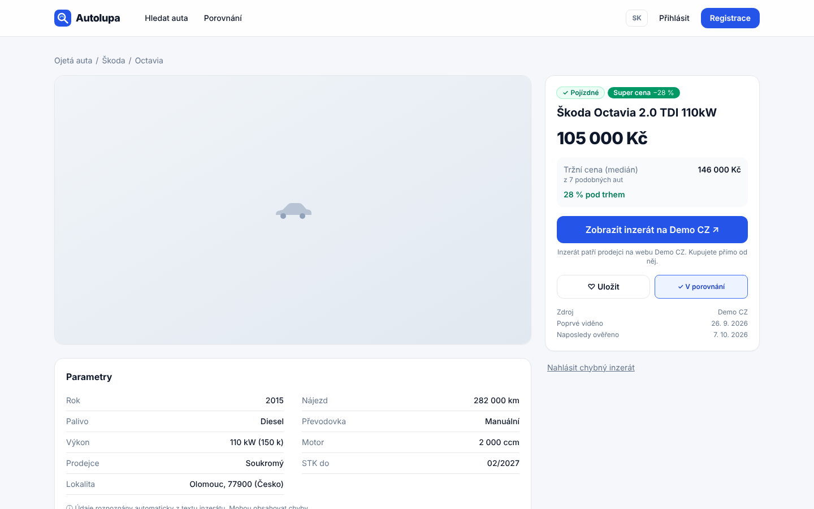
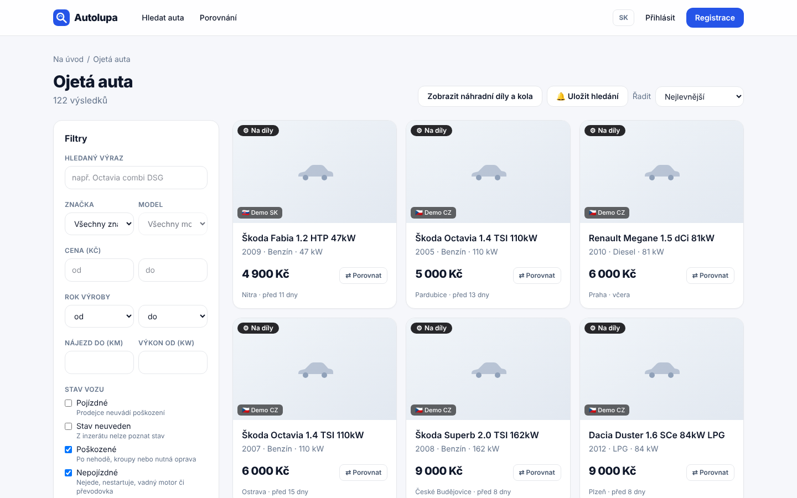
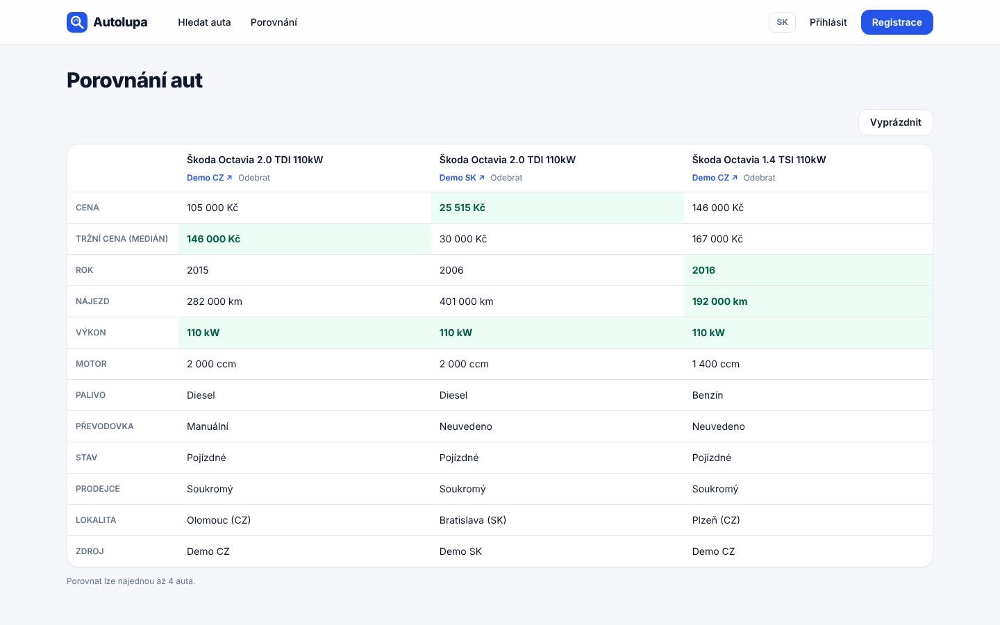
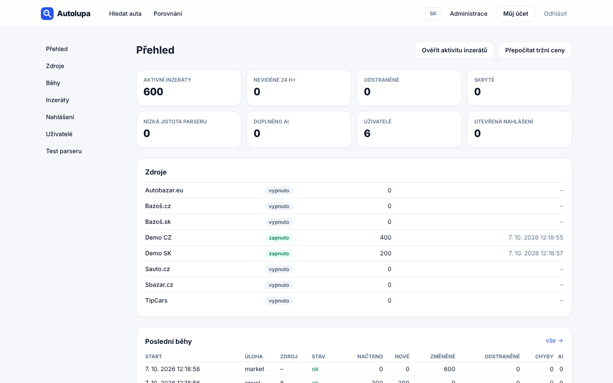
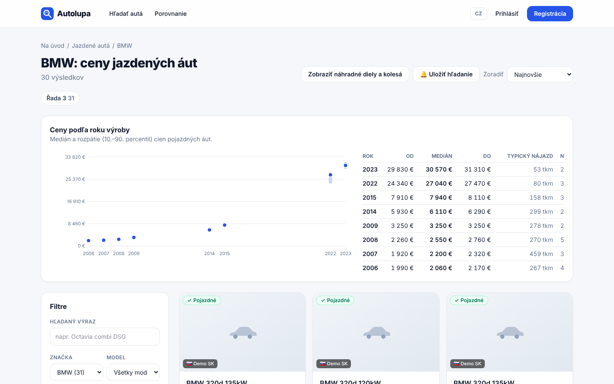
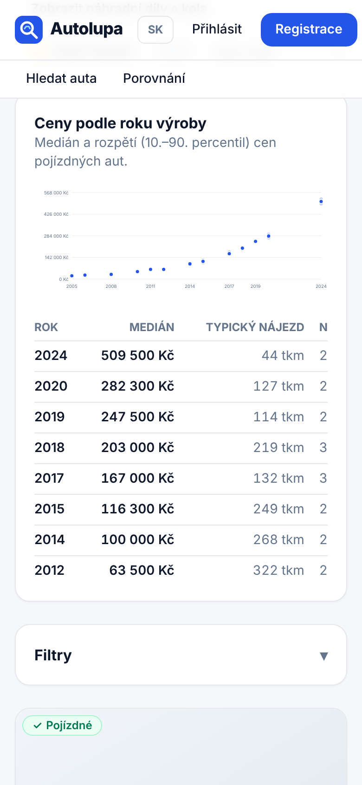
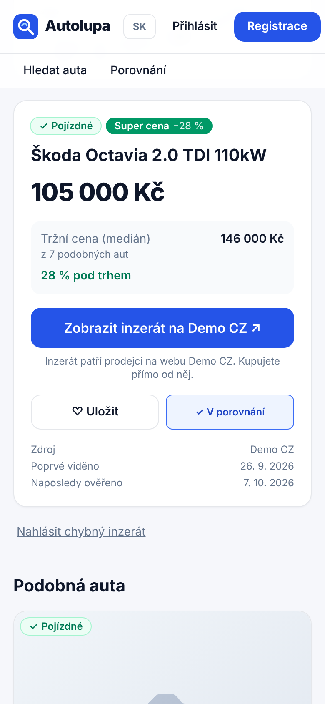

# Autolupa

**Find a used car at a fair price.** 
A price comparison site for used cars in Czechia and Slovakia that reads every ad and tells you whether the price is good.

🇨🇿 Čeština · 🇸🇰 Slovenčina · Kč · €

 

 

## ✨ Highlights

| | |
|---|---|
| 🔎 **All the ads in one place** | Listings from Czech and Slovak marketplaces and dealer feeds, searchable together |
| 🧠 **Smart ad reader** | Works out make, model, year, mileage, engine, fuel and gearbox from free text, in Czech and Slovak |
| 🏷️ **Honest condition labels** | Drivable, damaged, non-running and parts-only cars are labelled clearly and kept apart |
| 📊 **Fair price check** | Every car is compared with similar ones, so you see at a glance how far it is below or above the market |
| 🔁 **Same car, other sites** | Spots the same car advertised on more than one site and shows its price history |
| 🔄 **Always up to date** | New ads every 20 minutes; sold and removed ads disappear on their own |
| ⭐ **For signed-in users** | Bookmarks with price-drop alerts, saved searches and side-by-side comparison |
| 🌍 **Two countries** | Czech and Slovak, with prices in Kč or € at the daily Czech National Bank rate |
| 🔎 **SEO ready** | A landing page for every make and model, structured data, sitemap and clean URLs |
| 🎛️ **Admin panel** | Sources, crawl runs, parser checks, reports, users and an audit log |

 

## 🖼️ A closer look

<table>
  <tr>
    <td width="50%"> <b>Model pages</b>: typical prices for every production year, then the cars on offer</td>
    <td width="50%"> <b>Listing</b>: price against the market, parameters read from the ad, one click to the seller</td>
  </tr>
  <tr>
    <td> <b>Condition filters</b>: damaged, non-running and parts-only cars only when you ask for them</td>
    <td> <b>Compare</b>: up to four cars side by side, the best value in each row highlighted</td>
  </tr>
  <tr>
    <td> <b>Admin dashboard</b>: listings, sources, crawl runs and the audit log</td>
    <td> <b>Slovak version</b>: every page in Slovak, with prices in euros</td>
  </tr>
</table>

  
  &nbsp;
  
  &nbsp;
  
   <b>On the phone</b>: the same site, made for thumbs

 

## 🚗 For buyers

- **Quick search** from the landing page by make, model, price and year
- **Detailed filters** for mileage, power, fuel, gearbox, body, condition, country, seller type and VAT
- **Market price** for every car, worked out from comparable drivable cars only
- **Best deals** of the day on the landing page
- **Accounts** with bookmarks, saved searches with new-match counts, data export and account deletion
- **Clear legal pages**: terms, privacy policy and cookie policy, plus a cookie banner

## 🧑‍💼 For the site owner

- **Sources** switched on and off from the admin, each with its legal status noted
- **Dealer XML feeds** added in a minute, with a published feed format for car dealers
- **Parser checks**: low-confidence ads, the evidence behind every value, and one-click corrections
- **Reports** from users about wrong or sold ads, with hide and resolve actions
- **Users**: roles and blocking, with every admin action written to an audit log

## 🧱 Built with

| Layer | Technology |
|---|---|
| Website and admin | Next.js 16, React 19, Tailwind CSS 4 |
| Database | PostgreSQL 16, Drizzle ORM, full-text search |
| Listing reader | Rule-based Czech and Slovak parser, with Claude for unclear ads |
| Data collection | Polite crawler that respects robots.txt, plus XML and RSS feeds |
| Background jobs | Scheduled worker for crawling, freshness checks, market prices and exchange rates |
| Security | Same-origin API (CORS), nonce-based CSP, rate limiting, bcrypt, secure cookies, SSRF protection |

 

## 🚀 Getting started

The site runs with Docker in a single step, and an optional demo data set lets you explore it before any real source is connected.

Installation, configuration, data sources and deployment notes are in **[docs/SETUP.md](docs/SETUP.md)**.

 

## 👤 Author

Designed and built by **Nikolas Malík**. 
🌐 [malikweb.eu](https://malikweb.eu) · GitHub [@GeronimoCZE](https://github.com/GeronimoCZE)

## 📄 License

Released under the [MIT License](LICENSE). © 2026 Nikolas Malík
